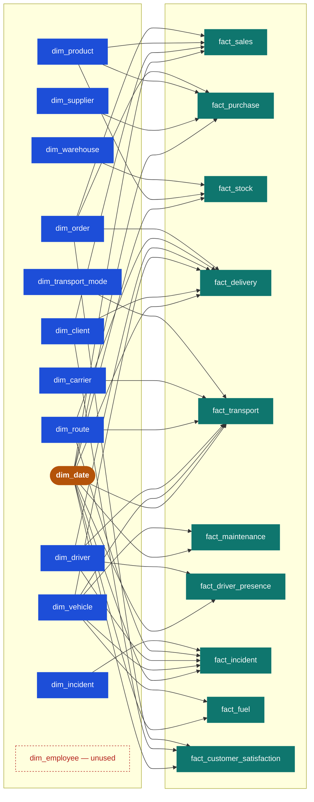

# Logistics DW — Data Model

Generated from [sql/schema.sql](../sql/schema.sql): 23 tables (10 facts, 13 dimensions), 37 foreign keys, one shared `dim_date` conformed across every fact.

For a rendered, browsable version with a bus matrix and full ERD, see the published artifact (ask Claude to re-open it), or view the diagrams below directly on GitHub — both render natively.

## Star schema overview

## Bus matrix

| fact \ dim | date | client | supplier | product | vehicle | driver | warehouse | route | carrier | incident | order | transport_mode | employee |
|---|---|---|---|---|---|---|---|---|---|---|---|---|---|
| fact_sales | ● | ● | | ● | | | | | | | ● | | |
| fact_purchase | ● | | ● | ● | | | | | | | ● | | |
| fact_stock | ● | | | ● | | | ● | | | | | | |
| fact_delivery | ● | ● | | | ● | ● | | ● | | | ● | | |
| fact_transport | ● | | | | ● | ● | | ● | ● | | | ● | |
| fact_maintenance | ● | | | | ● | | | | | | | | |
| fact_driver_presence | ● | | | | | ● | | | | | | | |
| fact_incident | ● | | | | ● | ● | | ● | | ● | | | |
| fact_fuel | ● | | | | ● | | | | | | | | |
| fact_customer_satisfaction | ● | ● | | | | | | | | | ● | | |
| **coverage** | **10/10** | 3/10 | 1/10 | 2/10 | 4/10 | 4/10 | 1/10 | 3/10 | 1/10 | 1/10 | 3/10 | 1/10 | **0/10** |

## Full ERD (all columns)

```mermaid
erDiagram
    dim_date ||--o{ fact_sales : "sk_date"
    dim_client ||--o{ fact_sales : "sk_client"
    dim_product ||--o{ fact_sales : "sk_product"
    dim_order ||--o{ fact_sales : "sk_order"
    dim_date ||--o{ fact_purchase : "sk_date"
    dim_supplier ||--o{ fact_purchase : "sk_supplier"
    dim_product ||--o{ fact_purchase : "sk_product"
    dim_order ||--o{ fact_purchase : "sk_order"
    dim_date ||--o{ fact_stock : "sk_date"
    dim_product ||--o{ fact_stock : "sk_product"
    dim_warehouse ||--o{ fact_stock : "sk_warehouse"
    dim_date ||--o{ fact_delivery : "sk_date"
    dim_order ||--o{ fact_delivery : "sk_order"
    dim_driver ||--o{ fact_delivery : "sk_driver"
    dim_vehicle ||--o{ fact_delivery : "sk_vehicle"
    dim_route ||--o{ fact_delivery : "sk_route"
    dim_client ||--o{ fact_delivery : "sk_client"
    dim_date ||--o{ fact_transport : "sk_date"
    dim_route ||--o{ fact_transport : "sk_route"
    dim_vehicle ||--o{ fact_transport : "sk_vehicle"
    dim_driver ||--o{ fact_transport : "sk_driver"
    dim_carrier ||--o{ fact_transport : "sk_carrier"
    dim_transport_mode ||--o{ fact_transport : "sk_transport_mode"
    dim_date ||--o{ fact_maintenance : "sk_date"
    dim_vehicle ||--o{ fact_maintenance : "sk_vehicle"
    dim_date ||--o{ fact_driver_presence : "sk_date"
    dim_driver ||--o{ fact_driver_presence : "sk_driver"
    dim_date ||--o{ fact_incident : "sk_date"
    dim_incident ||--o{ fact_incident : "sk_incident"
    dim_driver ||--o{ fact_incident : "sk_driver"
    dim_vehicle ||--o{ fact_incident : "sk_vehicle"
    dim_route ||--o{ fact_incident : "sk_route"
    dim_date ||--o{ fact_fuel : "sk_date"
    dim_vehicle ||--o{ fact_fuel : "sk_vehicle"
    dim_date ||--o{ fact_customer_satisfaction : "sk_date"
    dim_client ||--o{ fact_customer_satisfaction : "sk_client"
    dim_order ||--o{ fact_customer_satisfaction : "sk_order"

    dim_date {
        integer sk_date PK
        text full_date
        text year_month
        text year_quarter
        integer month_sort_key
        integer day_num
        text day_name
        integer week_num
        integer month_num
        text month_name
        integer quarter_num
        integer semester_num
        integer year_num
        integer is_weekend
        integer is_holiday
        text country_code
    }
    dim_client {
        integer sk_client PK
        text client_code
        text client_name
        text client_type
        text sector_activity
        text city
        text region
        text country_code
        real latitude
        real longitude
        text creation_date
        text loyalty_level
        real credit_limit
        integer credit_score
        real satisfaction_score
        text segment
    }
    dim_supplier {
        integer sk_supplier PK
        text supplier_code
        text supplier_name
        text supplier_type
        text city
        text region
        text country_code
        text contact_name
        text phone
        text email
        real reliability_score
        real avg_delivery_days
        real on_time_delivery_rate
        text status
    }
    dim_product {
        integer sk_product PK
        text product_code
        text product_name
        text category
        text sub_category
        text brand
        real weight_kg
        real volume_m3
        real purchase_price
        real sale_price
        real storage_temperature_c
        integer is_fragile
        integer shelf_life_days
        text unit_name
    }
    dim_vehicle {
        integer sk_vehicle PK
        text vehicle_id
        text plate_number
        text vehicle_type
        text brand
        text model
        integer model_year
        real capacity_weight_kg
        real capacity_volume_m3
        text fuel_type
        real avg_consumption_l_100km
        real odometer_km
        text last_maintenance_date
        text next_maintenance_date
        text status
    }
    dim_driver {
        integer sk_driver PK
        text driver_code
        text last_name
        text first_name
        text gender
        text birth_date
        text hire_date
        integer experience_years
        text license_type
        text phone
        real salary_monthly
        text availability
        text status
        text country_code
    }
    dim_warehouse {
        integer sk_warehouse PK
        text warehouse_code
        text warehouse_name
        text city
        text region
        text country_code
        text warehouse_type
        real area_m2
        integer capacity_pallets
        text manager_name
    }
    dim_route {
        integer sk_route PK
        text route_code
        text departure_city
        text arrival_city
        text country_code
        real distance_km
        real planned_time_hours
        integer toll_count
        text difficulty_level
        text zone_type
    }
    dim_carrier {
        integer sk_carrier PK
        text carrier_code
        text carrier_name
        text carrier_type
        real cost_per_km
        real performance_score
        text sla_level
    }
    dim_employee {
        integer sk_employee PK
        text employee_code
        text last_name
        text first_name
        text department
        text role_name
        text manager_name
        text hire_date
        real salary_monthly
        text status
        text country_code
    }
    dim_incident {
        integer sk_incident PK
        text incident_code
        text incident_type
        text category
        text severity_level
        text main_cause
    }
    dim_order {
        integer sk_order PK
        text order_number
        text order_type
        text priority_level
        text sales_channel
        text order_status
    }
    dim_transport_mode {
        integer sk_transport_mode PK
        text transport_mode_code
        text transport_mode
        text vehicle_type
        real standard_delay_hours
        real avg_cost_per_km
    }
    fact_sales {
        integer fact_sales_id PK
        integer sk_date FK
        integer sk_client FK
        integer sk_product FK
        integer sk_order FK
        real quantity_units
        real unit_sale_price
        real revenue_amount
        real cost_amount
        real margin_amount
        real margin_rate
        text margin_band
        real discount_amount
    }
    fact_purchase {
        integer fact_purchase_id PK
        integer sk_date FK
        integer sk_supplier FK
        integer sk_product FK
        integer sk_order FK
        real quantity_units
        real purchase_unit_price
        real purchase_amount
        real planned_delay_days
        real real_delay_days
        real delay_gap_days
    }
    fact_stock {
        integer fact_stock_id PK
        integer sk_date FK
        integer sk_product FK
        integer sk_warehouse FK
        real stock_theoretical
        real stock_real
        real stock_value_amount
        real safety_stock
        integer stockout_flag
        text stock_status
    }
    fact_delivery {
        integer fact_delivery_id PK
        integer sk_date FK
        integer sk_order FK
        integer sk_driver FK
        integer sk_vehicle FK
        integer sk_route FK
        integer sk_client FK
        real planned_delay_hours
        real real_delay_hours
        real delay_minutes
        text delay_category
        integer delivered_on_time_flag
        real service_rate
    }
    fact_transport {
        integer fact_transport_id PK
        integer sk_date FK
        integer sk_route FK
        integer sk_vehicle FK
        integer sk_driver FK
        integer sk_carrier FK
        integer sk_transport_mode FK
        real distance_km
        real duration_hours
        real transport_cost_amount
        real transport_cost_per_km
        real fill_rate
        text fill_rate_band
        real co2_kg
    }
    fact_maintenance {
        integer fact_maintenance_id PK
        integer sk_date FK
        integer sk_vehicle FK
        real maintenance_cost_amount
        real immobilization_hours
        integer breakdown_flag
    }
    fact_driver_presence {
        integer fact_presence_id PK
        integer sk_date FK
        integer sk_driver FK
        integer present_flag
        real worked_hours
        integer absence_flag
        integer late_flag
        text attendance_status
    }
    fact_incident {
        integer fact_incident_id PK
        integer sk_date FK
        integer sk_incident FK
        integer sk_driver FK
        integer sk_vehicle FK
        integer sk_route FK
        real incident_cost_amount
        real severity_score
        text severity_band
        real resolution_hours
        integer accident_flag
    }
    fact_fuel {
        integer fact_fuel_id PK
        integer sk_date FK
        integer sk_vehicle FK
        real liters
        real fuel_cost_amount
        real odometer_km
        real consumption_l_100km
    }
    fact_customer_satisfaction {
        integer fact_satisfaction_id PK
        integer sk_date FK
        integer sk_client FK
        integer sk_order FK
        real satisfaction_score
        text satisfaction_band
        integer complaint_flag
        text nps_class
        real resolution_hours
    }
```

## Reading notes

- **Conformed backbone** — `dim_date` is the only dimension joined to all 10 facts; it's what lets the dashboards' shared country/year filters work across every page.
- **Two-hop dimensions** — `dim_vehicle` and `dim_driver` each reach 4 facts: fleet and workforce activity is the most cross-cut part of the model.
- **Orphan table** — `dim_employee` has no fact referencing it. It's loaded but unused by the star schema (see "what we can add" in [kpi_documentation.md](kpi_documentation.md) for a possible HQ/RH fact).
- **Surrogate keys** — every table uses an integer `sk_*` primary key, decoupled from the natural `*_code` business key — standard Kimball practice for slow-changing dimensions.
